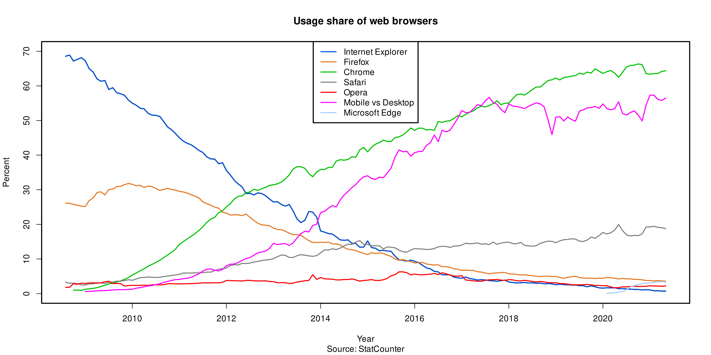

# Protection FireFox
## Auteur :  z0S.i0S  - Maj : 10/04/2025

## Introduction

Lorsque vous visitez une page web, votre navigateur envoie volontairement des informations sur sa configuration, telles que les polices disponibles, le type de navigateur et les add-ons. Si cette combinaison d'informations est unique, il peut être possible de vous identifier et de vous suivre sans utiliser de cookies.

## Fichier de profil

cf. https://kb.mozillazine.org/User.js_file

Un fichier **user.js** est une autre méthode de modification des préférences, recommandée uniquement pour les utilisateurs avancés. Sauf si vous avez besoin d'un fichier user.js pour un usage spécifique, vous devez utiliser à la place **about:config**. Le fichier user.js n'existe pas par défaut.

about:support => fichier profil

## Elements modifiables

- "Firefox Preferences" ou "**about:preferences#privacy**" :
  - Général : Firefox est votre navigateur par défaut
    - Onglets :
      - À l’ouverture d’un lien, d’une image ou d’un média dans un nouvel onglet, basculer vers celui-ci immédiatement : ${\color{red}OFF}$
      - Extensions X : ${\color{red}OFF}$
      - Activer les onglets conteneurs  : ${\color{green}ON}$
    - Fichiers et applications :
      - Enregistrer les fichiers :  ${\color{green}ON}$
      - Lire le contenu protégé par des DRM : ${\color{green}ON}$
    - Mises à jour de Firefox  :
      - Vérifier l’existence de mises à jour, mais vous laisser décider de leur installation
    - Performances : 
      - Utiliser les paramètres de performance recommandés : ${\color{green}ON}$ (cf "**about:memory**" et "**about:processes**")
    - Navigation :
      - Lancer la recherche lors de la saisie de texte : ${\color{red}OFF}$
      - Activer les contrôles pour l’incrustation vidéo: ${\color{green}ON}$ 
      - Contrôler la lecture des médias via le clavier, un casque ou l’interface virtuelle : ${\color{green}ON}$ 
      - Recommander des extensions en cours de navigation :  ${\color{red}OFF}$
      - Recommander des fonctionnalités en cours de navigation : ${\color{red}OFF}$
    - Paramètres réseau :
      - Configuration manuelle du proxy :  => Burp
        - Proxy HTTP : 127.0.0.1
        - Port : 8000
  - Accueil :
    - Nouvelles fenêtres et nouveaux onglets :
      - Page d’accueil et nouvelles fenêtres : Page vide
      - Nouveaux onglets : Page vide
    - Contenu de la Page d’accueil de Firefox :
      - Recherche web : ${\color{green}ON}$ 
      - Raccourcis : ${\color{red}OFF}$
      - Articles recommandés : ${\color{red}OFF}$
      - Activité récente : ${\color{red}OFF}$
    - Recherche :
      - Moteur de recherche par défaut  : Duckduckgo
      - Suggestions de recherche : 
        - Afficher les suggestions de recherche : ${\color{red}OFF}$
        - Afficher les recherches récentes : ${\color{red}OFF}$
    - Vie privée :
      - Protection renforcée contre le pistage : Personnalisée
        - Cookies : Cookies de pistage intersites et isolation des autres cookies intersites
        - Contenu utilisé pour le pistage : dans toutes les fenêtres
        - Mineurs de cryptomonnaies : ${\color{green}ON}$ 
        - Détecteurs d’empreinte numérique connus : ${\color{green}ON}$ 
        - Détecteurs d’empreinte numérique suspectés :  dans toutes les fenêtres
      - Mots de passe  :
        - Proposer d’enregistrer les mots de passe : ${\color{red}OFF}$
        - Afficher des alertes pour les mots de passe de sites concernés par des fuites de données : ${\color{red}OFF}$
        - Utiliser un mot de passe principal : ${\color{red}OFF}$
      - Remplissage automatique :
        - Enregistrer et remplir automatiquement les adresses  : ${\color{red}OFF}$
      - Historique :
        - Toujours utiliser le mode de navigation privée : ${\color{green}ON}$
      - Permissions :
        - Bloquer les fenêtres popup : ${\color{green}ON}$
        - Prévenir lorsque les sites essaient d’installer des modules complémentaires : ${\color{green}ON}$
      - Collecte de données par Firefox et utilisation : 
        - Envoyer des données techniques et d’interaction à Mozilla : ${\color{red}OFF}$
        - Envoyer un ping quotidien d’utilisation à Mozilla : ${\color{red}OFF}$
        - Envoyer automatiquement les rapports de plantage : ${\color{red}OFF}$
      - Préférences publicitaires des sites web :
        - Autoriser les sites web à effectuer des mesures publicitaires en respectant la vie privée : ${\color{red}OFF}$
      - Sécurité :
        - Protection contre les contenus trompeurs et les logiciels dangereux :
          - Bloquer les contenus dangereux ou trompeurs : ${\color{green}ON}$
        - Certificats : 
          - Interroger le répondeur OCSP pour confirmer la validité de vos certificats : ${\color{red}OFF}$
          - Autoriser Firefox à faire automatiquement confiance aux certificats racines tiers que vous installez : ${\color{green}ON}$
        - Mode HTTPS uniquement :
          - Activer le mode HTTPS uniquement dans toutes les fenêtres : ${\color{green}ON}$
        - DNS via HTTPS : 
          - Activer le DNS via HTTPS en utilisant : Protection maximale
      - Synchronisation : ${\color{red}OFF}$

- about:addons :
  - Extensions : 
    - Autoriser les mises à jour automatiques : ${\color{red}OFF}$
  - Thèmes :
    - Autoriser les mises à jour automatiques : ${\color{red}OFF}$
  - Plugins : 
    - Autoriser les mises à jour automatiques : ${\color{red}OFF}$

- "**about:config**" : variable selon  version du navigateur. 

<u>Nota :</u> Chercher par mot clé pour retrouver les paramètres en rapport. Recherches générales : "stream", "update","extensions", "privacy"
  
  - StartUp Settings : cf "browser"
  - Geolocation : cf "geo"
  - Language / Locale : cf  "local"
  - Auto-updates / Recommendations : cf "update"
  - Telemetry : cf "telemetry"
  - Studies : cf "studies"
  - Crash Reports : cf "crash"
  - Captive Portal Detection / Network Checks : cf "detection"
  - Safe Browsing : cf "safe"
  - Network: DNS, Proxy, IPv6 : cf "dns" 
  - Search Bar: Suggestions, Autofill : cf "search"
  - Passwords : cf "passw"
  - Disk Cache / Memory : cf "disk"
  - HTTPS / SSL/TLS / OSCP / CERTS : cf "http" 
  - Headers / Referers : cf "head"
  - Audio/Video: WebRTC, WebGL, DRM : cf "web" 
  - Downloads : cf "down"
  - Cookies : cf "cook"
  - UI Features : cf "ui"
  - Extensions : cf "extension"
  - Shutdown Settings : cf "shutdown"
  - Fingerprinting (RFP) : cf "finger"

## Extensions

- User-Agent : 
  - [User Agent Switcher](https://addons.mozilla.org/fr/firefox/addon/uaswitcher/)
  - [Modify Header Value](https://addons.mozilla.org/fr/firefox/addon/modify-header-value/)
- canvas fingerprinting : 
  - [canvas fingerprinting](https://fr.wikipedia.org/wiki/Canvas_fingerprinting)
  - [canvas fingerprinting](https://addons.mozilla.org/fr/firefox/addon/canvas-fingerprint-defender/)
- empreinte WebGL :
  - [empreinte WebGL](https://addons.mozilla.org/fr/firefox/addon/webgl-fingerprint-defender/)
- anti-tracking :
  - [uBlock Origin](https://addons.mozilla.org/en-US/firefox/addon/ublock-origin/)
- Browser Leak Tests :
    - [coveryourtracks](https://coveryourtracks.eff.org/)
    - [amiunique](https://www.amiunique.org/)
    - [browserleaks](https://browserleaks.com/)
    - [arkenfox](https://arkenfox.github.io/TZP/tzp.html)
    - [Firefox Lightbeam](https://github.com/mozilla/lightbeam-we), équivalent de **chrome://discards** => donne l'activité du navigateur avec les extensions activées et les pages affichées

## Parts de marché des  navigateurs

